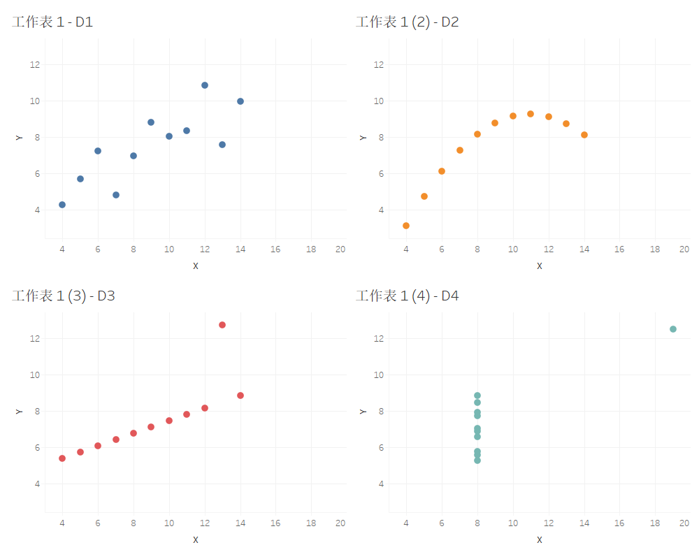
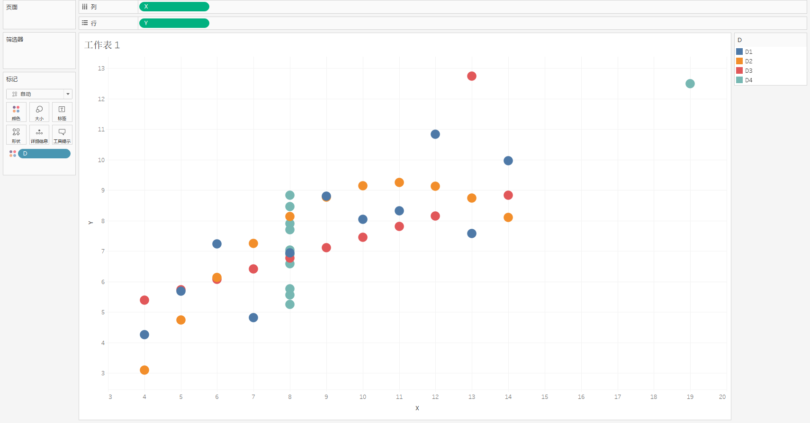
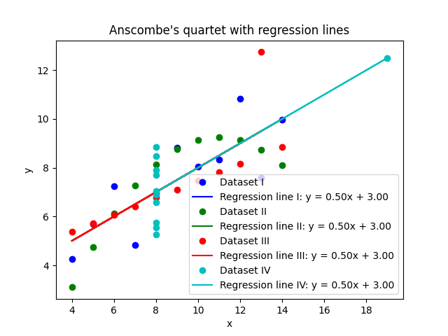

# 20214181-周磊-第1次作业

## 数据可视化第1次作业

### 版本状态：

- [ ] 进行
- [x] 提交

------

### 学生信息：

| 姓名 | 专业     | 学号     |
| ---- | -------- | -------- |
| 周磊 | 人工智能 | 20214181 |

------

### 任务描述：

- **任务1：**
  - 设计或开发工作：
    - 用可视化软件或工具（包括但不限于Tableau，Excel，Weka，Weave）对课程第1讲教学内容中所涉及的数据集进行分析，将四组数据进行可视化；
    - 提示：
      - 每组数据可以单独用1个散点图，最后生成4个散点图；
      - 请注意图表的设置，配色要美观；
      - 尝试使用1个散点图，对每组数据使用不同的颜色进行编码；
  - 文字阐述工作：
    - 根据你自己的知识来说明这四组数据的分布特征；
    - 提示：
      - 可以结合均值、方差、相关系数等统计特征进行分析；引用必要的文献；给出必要的公式；
    - 结合这个任务，用适当文字阐述数据可视化的意义和价值；
- **任务2：**
  - 用脚本语言或编程语言，计算四组数据的最小二乘法回归线方程；
    - 提示：
      - 请将代码贴入到石墨文档，使用【插入】—【</>代码块】方式；
      - 简单描述自己使用的脚本语言或编程语言类型；
      - 给出计算结果，并进行相应的阐述；查阅和引用相关资料，阐述最小二乘法回归线方程的相关知识；可以使用【插入】—【Tex数学公式】的组件来编辑可能出现的数学公式或特殊的符号变量。
- 数据集：

| **s**  |        |        |        |        |        |        |        |
| ------ | ------ | ------ | ------ | ------ | ------ | ------ | ------ |
| **D1** |        | **D2** |        | **D3** |        | **D4** |        |
| **x1** | **y1** | **x2** | **y2** | **x3** | **y3** | **x4** | **y4** |
| 10.00  | 8.04   | 10.00  | 9.14   | 10.00  | 7.46   | 8.00   | 6.58   |
| 8.00   | 6.95   | 8.00   | 8.14   | 8.00   | 6.77   | 8.00   | 5.76   |
| 13.00  | 7.58   | 13.00  | 8.74   | 13.00  | 12.74  | 8.00   | 7.71   |
| 9.00   | 8.81   | 9.00   | 8.77   | 9.00   | 7.11   | 8.00   | 8.84   |
| 11.00  | 8.33   | 11.00  | 9.26   | 11.00  | 7.81   | 8.00   | 8.47   |
| 14.00  | 9.96   | 14.00  | 8.10   | 14.00  | 8.84   | 8.00   | 7.04   |
| 6.00   | 7.24   | 6.00   | 6.13   | 6.00   | 6.08   | 8.00   | 5.25   |
| 4.00   | 4.26   | 4.00   | 3.10   | 4.00   | 5.39   | 19.00  | 12.50  |
| 12.00  | 10.84  | 12.00  | 9.13   | 12.00  | 8.15   | 8.00   | 5.56   |
| 7.00   | 4.82   | 7.00   | 7.26   | 7.00   | 6.42   | 8.00   | 7.91   |
| 5.00   | 5.68   | 5.00   | 4.74   | 5.00   | 5.73   | 8.00   | 6.89   |
- 提交时间：2024/3/10

------

### 作业内容：

#### 任务1：

- 设计或开发工作：

  - 安装Tableau Desktop 2024.1

  - 生成四个散点图

    

  - 生成一个散点图，用不同颜色区分

    

- 文字阐述工作：

  - 计算均值：
    $$
    \bar X=\frac{X_1+X_2+...+X_n}{n}
    $$
    得$mean(D_1)=mean(D_2)=mean(D_3)=mean(D_4)=\begin{bmatrix}9.00 \\ 7.50\end{bmatrix}$

  - 计算方差：

    
    $$
    Var(X)=\frac{\sum(X_i-\bar X)^2}{n-1}
    $$
    得$var(D_1)=var(D_2)=var(D_3)=var(D_4)=\begin{bmatrix}10.00 \\ 3.75\end{bmatrix}$

  - 计算相关系数：

    
    $$
    r=\frac{\sum(X_i-\bar X)(Y_i-\bar Y)}{\sqrt{\sum(X_i-\bar X)^2\sum(Y_i-\bar Y)^2}}
    $$
    得$r(D_1)=r(D_2)=r(D_3)=r(D_4)=0.816$​

  - 可以发现这四组数据具有相同的简单描述性统计数据，但是通过观察散点图可以发现，四组数据具有非常不同的分布和趋势。可以说明在**分析数据之前先绘制图表**的重要性，以及**异常值**对统计特性的影响之大。因此可以说**数据可视化**是一个强有力的并且十分重要的工具。

  - 数据可视化能够帮助人们：

    - **直观理解数据**：图形和图表提供了对数据的直观感知，使复杂的信息更易于理解。通过可视化，人们能够迅速捕捉趋势、关系和模式。
    - **发现模式及异常**：数据可视化有助于识别数据中的潜在模式和异常值。直观的图形可以帮助分析人员在数据中发现隐藏的信息，从而提取有关趋势或异常的见解。
    - **交流和共享见解：** 数据可视化是一种强大的沟通工具，能够帮助将分析结果有效地传达给不同背景的观众。清晰的图形使得数据分析结果更易于分享和理解。

#### 任务2：

- 最小二乘法是一种数学优化技术，它通过最小化误差的平方和找到数据的最佳函数匹配。在统计学中，最小二乘法常用于线性回归，用于找到最佳拟合数据的直线。

  线性回归的目标是找到一个线性方程，该方程最好地描述了因变量（y）和自变量（x）之间的关系。这个线性方程通常写成 `y = mx + b` 的形式，其中 `m` 是斜率，`b` 是截距。

  最小二乘法的基本思想是，通过找到使得所有数据点到回归线的垂直距离（即残差）的平方和最小的直线，来确定这个线性方程的 `m` 和 `b`。换句话说，最小二乘法试图找到一条线，使得所有数据点围绕这条线的分布最紧密。

  在Python中，我们可以使用 `numpy` 的 `polyfit` 函数来进行最小二乘线性回归。这个函数会返回线性方程的斜率和截距。

  最小二乘法：
  $$
  y = \beta_0 + \beta_1x + \epsilon
  $$
  其中，`y` 是因变量，`x` 是自变量，$\beta_0$ 是截距，$\beta_1$是斜率，$\epsilon$是误差项。

  斜率$\beta_1$和截距 $\beta_0$​的计算公式如下：
  $$
  \beta_1 = \frac{\sum_{i=1}^{n}(x_i-\bar{x})(y_i-\bar{y})}{\sum_{i=1}^{n}(x_i-\bar{x})^2} \qquad
  \beta_0 = \bar{y} - \beta_1\bar{x}
  $$
  其中，$\bar{x}$和 $\bar{y}$分别是 `x` 和 `y` 的平均值，`n` 是数据点的数量。

  参考资料：
  1. "Least Squares Regression Line of Best Fit-Proof, Formula, Example." Statistics How To. https://www.statisticshowto.com/probability-and-statistics/regression-analysis/find-a-linear-regression-equation/
  2. "Linear regression." Wikipedia. https://en.wikipedia.org/wiki/Linear_regression
  3. "numpy.polyfit." NumPy. https://numpy.org/doc/stable/reference/generated/numpy.polyfit.html

- 使用Python中的numpy, seaborn, matplotlib库编写代码 [regression.py](regression.py)：

```python
import numpy as np
import seaborn as sns
import matplotlib.pyplot as plt

# Load the example dataset for Anscombe's quartet
df = sns.load_dataset("anscombe")

# Create a color map
colors = ['b', 'g', 'r', 'c']

# Create a figure and a set of subplots
fig, ax = plt.subplots()

# Calculate and plot the least squares regression line for each dataset
for i, color in zip(['I', 'II', 'III', 'IV'], colors):
    dataset = df[df['dataset'] == i]
    x = dataset['x']
    y = dataset['y']
    slope, intercept = np.polyfit(x, y, 1)
    ax.plot(x, y, 'o', color=color, label=f'Dataset {i}')
    ax.plot(x, slope*x + intercept, color=color, label=f'Regression line {i}: y = {slope:.2f}x + {intercept:.2f}')
    print(f'Regression line for Dataset {i}: y = {slope:.2f}x + {intercept:.2f}')

# Set title and labels
ax.set_title('Anscombe\'s quartet with regression lines')
ax.set_xlabel('x')
ax.set_ylabel('y')

# Show legend
ax.legend()

# Show the plot
plt.show()
```

- 程序输出：

```
Regression line for Dataset I: y = 0.50x + 3.00
Regression line for Dataset II: y = 0.50x + 3.00
Regression line for Dataset III: y = 0.50x + 3.00
Regression line for Dataset IV: y = 0.50x + 3.00
```



- 观察结果发现，四组数据的一元线性回归方程均为`y = 0.50x + 3.00`
